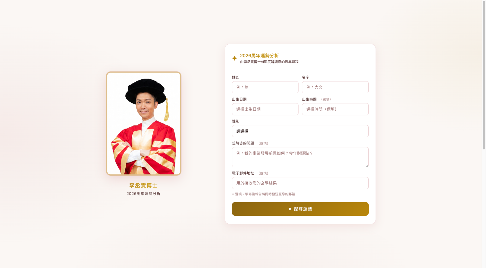
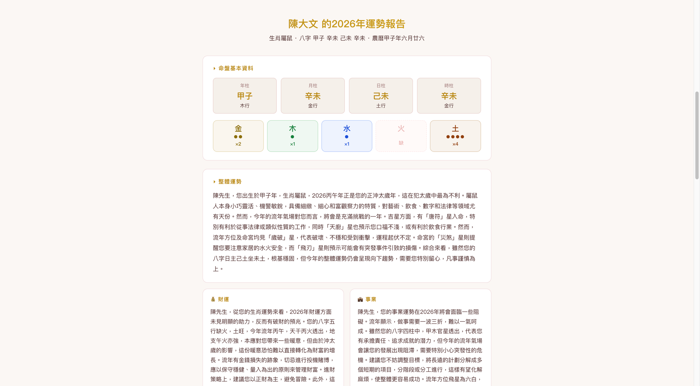
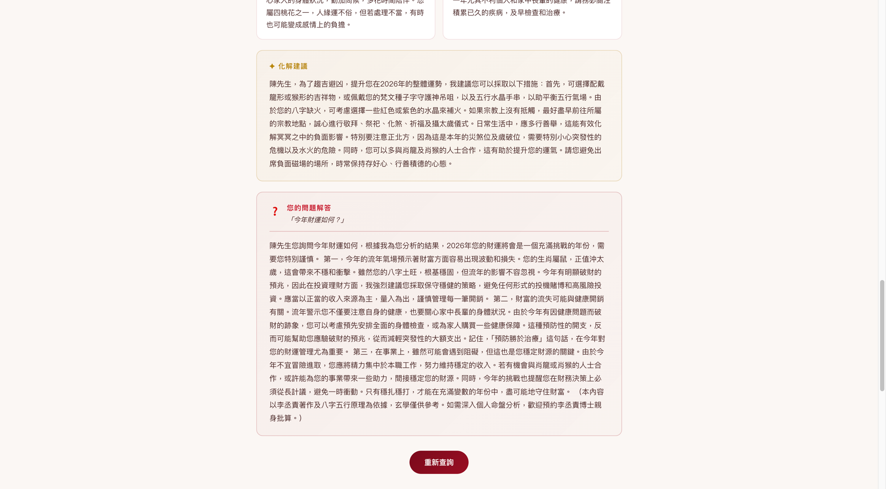

### Live Demo: https://lczai-chatbot.onrender.com

---

## Project Overview

This project is a **client-commissioned web application** developed between **June 2026 and July 2026**, currently live and in active use.

**Lee Shing Chak Fortune AI** is a RAG-based fortune-telling chatbot built for a professional fengshui and BaZi (Chinese astrology) consultant. Users submit their birth information and the system generates a personalized Chinese five-elements fortune analysis for the year, grounded in the consultant's published book.

Built solo end to end — RAG pipeline, frontend, email delivery, deployment — and iterated through multiple rounds of direct client feedback (UI theme, input methods, access control) while maintaining the live production environment.

---

## Approach & Methods

- **Data Processing:**
  - Extracted text from the client's source book (PDF) using PyMuPDF
  - Structured the extracted content into a JSON knowledge base

- **Fortune Analysis Engine:**
  - Computed BaZi (four pillars) and five-elements distribution from user birth data
  - Combined keyword-based retrieval over the knowledge base with the Gemini API to generate personalized narrative analysis

- **Delivery:**
  - Implemented client-side email delivery of the full HTML report via EmailJS, removing the need for a backend mail server

---

## Technical Challenges

- **Unreliable outbound email on a free-tier host:** Initial email delivery via a backend SMTP/API integration was inconsistent on Render's free tier. Iterated through a third-party HTTP email API, then Gmail SMTP with forced IPv4, before moving delivery to the client side via EmailJS — eliminating the backend mail dependency entirely and resolving the reliability issue.
- **Cold start on free hosting:** Render's free tier spins the service down after inactivity, causing a visible delay and a platform loading screen on the first request after idle. Evaluated always-on alternatives and keep-alive strategies to balance cost against user experience for a client-facing site.

---

## Key Features

- Personalized BaZi and five-elements fortune analysis generated from user birth data
- RAG-based question answering grounded in the client's published book
- Automated email delivery of the full report
- Site-wide password protection to restrict access to authorized traffic
- Iteratively refined UI based on client feedback

---

## Tools & Technologies

- **Backend:** Python, Flask
- **AI:** Google Gemini 1.5 Flash
- **Knowledge Retrieval:** JSON-based keyword matching RAG
- **PDF Extraction:** PyMuPDF (fitz)
- **Email:** EmailJS (client-side delivery)
- **Deployment:** Render (continuous deployment from GitHub)

---

## Project Structure

```
lee-shing-chak-fortune/
├── data/
│   ├── raw/              Source PDF and extracted text
│   └── knowledge/        Processed JSON knowledge base
├── scripts/
│   ├── extract_pdf.py    PDF text extraction
│   ├── build_knowledge.py Knowledge base builder
│   └── generate_qa.py    Training data generation
├── app/
│   ├── main.py           Flask application
│   ├── rag.py            RAG search engine
│   └── templates/
│       ├── index.html    Main chat interface
│       └── login.html    Access control page
├── training/
│   └── qa_data.jsonl     Fine-tuning training data
├── .env.example
├── requirements.txt
└── README.md
```

## Screenshots





## Local Setup

```bash
pip3 install -r requirements.txt
cp .env.example .env
# Edit .env with your Gemini API key, SITE_PASSWORD, etc.

python3 scripts/extract_pdf.py       # Extract PDF text
python3 scripts/build_knowledge.py   # Build knowledge base

cd app
python3 main.py
```

Open http://localhost:5000 in your browser.
