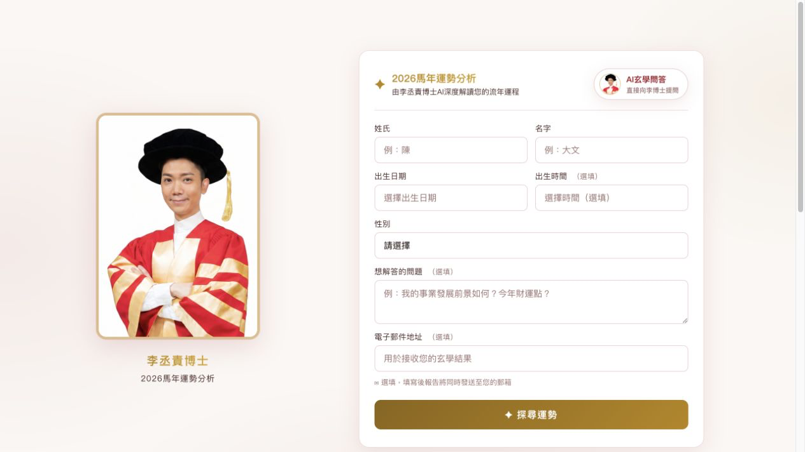
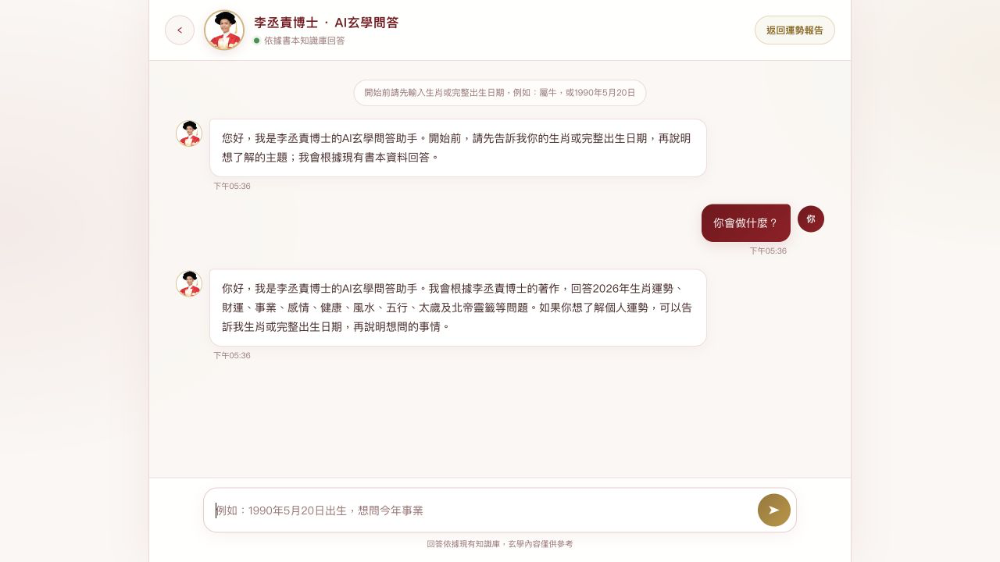
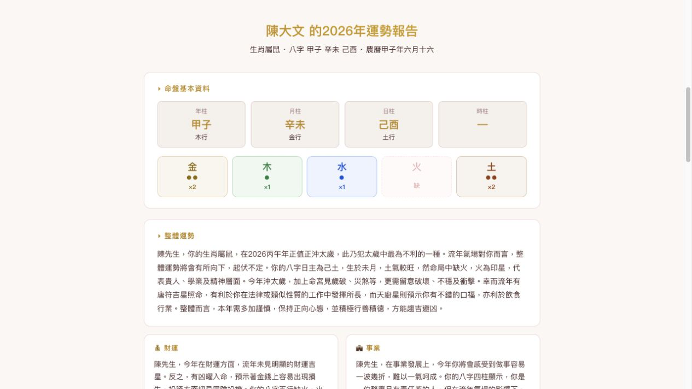
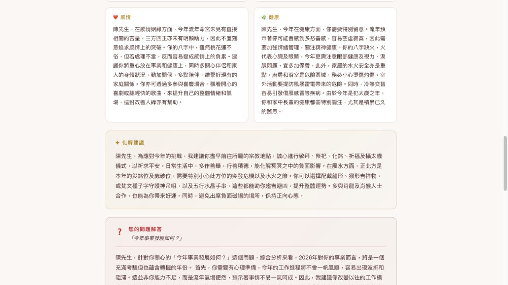

# Lee Shing Chak Fortune AI

### Live Demo: https://lczai-chatbot.onrender.com

---

## Project Overview

This project is a **client-commissioned web application** developed between **June 2026 and July 2026**, currently live and in active use.

**Lee Shing Chak Fortune AI** is a production RAG application built for a professional fengshui and BaZi (Chinese astrology) consultant. It has two connected user experiences: a structured personal fortune report and a conversational AI assistant. Both use the same book-grounded retrieval layer, while the report also combines deterministic BaZi and five-elements calculations with Gemini-generated narrative analysis.

Built solo end to end — RAG pipeline, frontend, email delivery, deployment — and iterated through multiple rounds of direct client feedback (UI theme, input methods, access control) while maintaining the live production environment.

---

## Approach & Methods

- **Data Processing:**
  - Extracted text from the client's source book (PDF) using PyMuPDF
  - Structured the extracted content into a JSON knowledge base

- **Fortune Analysis Engine:**
  - Computed BaZi (four pillars) and five-elements distribution from user birth data
  - Combined deterministic zodiac/topic filtering, keyword scoring, and Gemini semantic embeddings
  - Prioritized exact metadata matches and used a conditional Gemini reranker only for genuinely ambiguous semantic candidates
  - Added a calibrated relevance threshold, source/page metadata, stale-index detection, and automatic keyword fallback when embedding generation is unavailable
  - Verified every fixed report section against the matching zodiac and topic before generation
  - Used Gemini to generate personalized narrative analysis from the retrieved source passages

- **Conversational Layer:**
  - Stored birth date, zodiac, gender, and recent topics as structured server-side session memory
  - Replaced stale identity data automatically when a user supplies a different zodiac or birth date
  - Routed greetings, self-introductions, thanks, and other lightweight conversation without invoking RAG
  - Prevented unsupported questions from being presented as book-grounded answers
  - Kept source metadata available for backend verification and testing without exposing citation blocks in the user interface

- **Delivery:**
  - Implemented client-side email delivery of the full HTML report via EmailJS, removing the need for a backend mail server

---

## Technical Challenges

- **Grounding without noisy retrieval:** Exact zodiac and topic matches need deterministic priority, while paraphrased questions still benefit from semantic search. The retrieval pipeline now uses metadata-first ranking, semantic fallback, relevance gating, and conditional reranking rather than applying one strategy to every query.
- **Useful memory without user-facing complexity:** Free-form chat history was converted into a small structured profile. The server silently updates or replaces identity data when the conversation changes person, while the browser only stores a random session identifier.
- **Unreliable outbound email on a free-tier host:** Initial email delivery via a backend SMTP/API integration was inconsistent on Render's free tier. Iterated through a third-party HTTP email API, then Gmail SMTP with forced IPv4, before moving delivery to the client side via EmailJS — eliminating the backend mail dependency entirely and resolving the reliability issue.
- **Cold start on free hosting:** Render's free tier spins the service down after inactivity, causing a visible delay and a platform loading screen on the first request after idle. Evaluated always-on alternatives and keep-alive strategies to balance cost against user experience for a client-facing site.

---

## Key Features

- Personalized BaZi and five-elements fortune analysis generated from user birth data
- Report and chat interfaces with direct navigation between them
- Hybrid RAG with metadata filters, keyword scoring, semantic embeddings, and relevance gating
- Conditional reranking for ambiguous retrieval results
- Structured 24-hour conversational memory with automatic identity replacement
- Natural handling for greetings, capabilities, self-introduction, thanks, and goodbyes
- Grounded refusal and clarification flows for unsupported or incomplete questions
- Plain-text chat output without leaked Markdown formatting
- Automated email delivery of the full report
- Site-wide password protection to restrict access to authorized traffic
- Automated retrieval evaluation and regression tests

---

## Tools & Technologies

- **Backend:** Python, Flask
- **AI:** Google Gemini 2.5 Flash and Gemini Embedding
- **Knowledge Retrieval:** Hybrid RAG (metadata filters + keyword scoring + semantic similarity)
- **PDF Extraction:** PyMuPDF (fitz)
- **Email:** EmailJS (client-side delivery)
- **Deployment:** Render (continuous deployment from GitHub)

---

## Project Structure

```
lee-shing-chak-fortune/
├── data/
│   ├── raw/              Source PDF and extracted text
│   └── knowledge/        Processed JSON knowledge base
├── scripts/
│   ├── extract_pdf.py    PDF text extraction
│   ├── build_knowledge.py Knowledge base builder
│   ├── build_embedding_index.py Precompute the semantic retrieval index
│   ├── evaluate_rag.py   Run the labelled retrieval evaluation suite
│   ├── audit_knowledge_chunks.py Audit knowledge metadata and chunk quality
│   └── generate_qa.py    Training data generation
├── app/
│   ├── main.py           Flask application
│   ├── rag.py            RAG search engine
│   └── templates/
│       ├── index.html    Conversational AI interface
│       ├── index_new.html Personal report interface
│       └── login.html    Access control page
├── tests/
│   ├── fixtures/         Labelled retrieval evaluation cases
│   ├── test_chat_api.py  Chat, memory, report, and reranker tests
│   └── test_rag.py       Retrieval and grounding tests
├── docs/
│   └── RAG_IMPROVEMENT_ROADMAP.md Architecture and evaluation notes
├── training/
│   └── qa_data.jsonl     Fine-tuning training data
├── .env.example
├── requirements.txt
└── README.md
```

## Screenshots






## Local Setup

```bash
pip3 install -r requirements.txt
cp .env.example .env
# Edit .env with your Gemini API key, SITE_PASSWORD, etc.

python3 scripts/extract_pdf.py       # Extract PDF text
python3 scripts/build_knowledge.py   # Build knowledge base
python3 scripts/build_embedding_index.py  # Build semantic index after knowledge changes
python3 scripts/evaluate_rag.py           # Run the labelled live semantic evaluation
python3 scripts/audit_knowledge_chunks.py # Audit chunk length, metadata, and duplicates

cd app
python3 main.py
```

Open http://localhost:5000 in your browser.

## Verification

```bash
# Run the application regression suite
python3 -m unittest discover -s tests -v

# Run 56 labelled retrieval cases (requires GEMINI_API_KEY for live embeddings)
python3 scripts/evaluate_rag.py

# Check formatting and knowledge quality
python3 scripts/audit_knowledge_chunks.py
```

The semantic index is checked against a hash of the knowledge corpus at startup. If it is
missing, stale, or the query embedding request fails, retrieval automatically falls back to
the existing metadata and keyword strategy. `GET /health` reports whether semantic search
is active and how many document embeddings were loaded.

The chat profile is stored server-side for up to 24 hours and is keyed by a random session
identifier. Supplying a new zodiac or complete birth date replaces the previous identity
data automatically. The retrieval pipeline keeps structured source metadata for grounding,
logs, and tests, while the public report and chat interfaces present clean answers without
source-attribution panels.

See [RAG Improvement Roadmap](./docs/RAG_IMPROVEMENT_ROADMAP.md) for the current retrieval
architecture, relevance-threshold rationale, evaluation plan, and recommended next steps.
